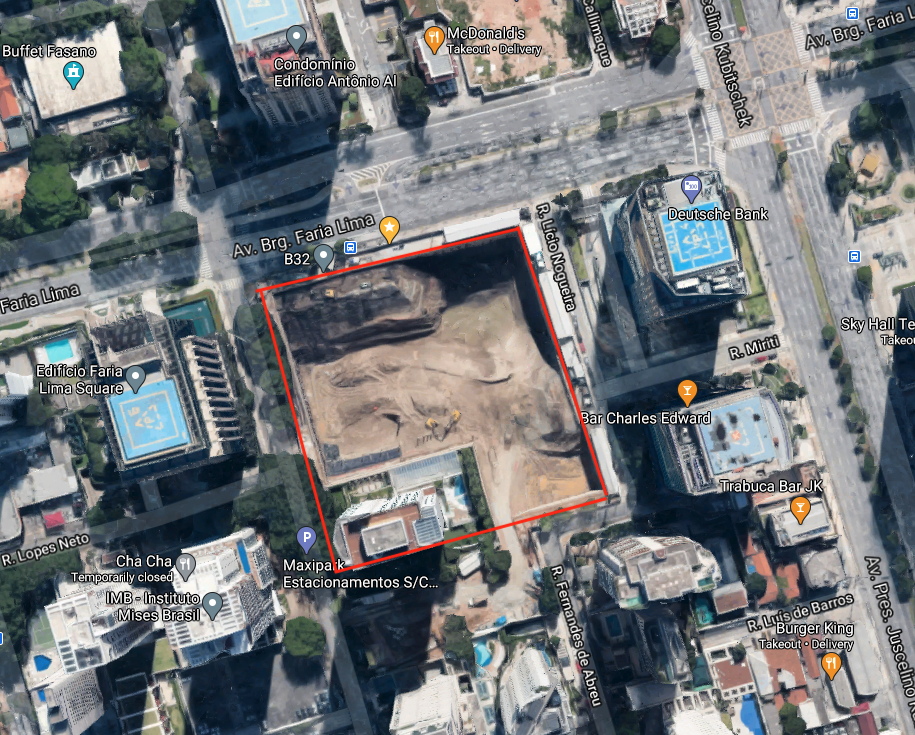

# HID Project

## Project


### We are monitoring the following area, please add sensors inside this area



You can find the exact location on [Google Maps](https://www.google.com/maps/@-23.5895672,-46.6825731,608a,35y,90h/data=!3m1!1e3).

The coordnates are: (-23.589400041446943, -46.68245668536507).

### Running locally

```
npm start
```

## Backend requirements

#### GET /estimatedNoiseValues

```localhost:5000/estimatedNoiseValues```

Request body example:

```
{
    lonMatrix: [
        [
            -46.682009518288844,
            -46.68200695045289,
        ],
        [
            -46.68200438261693,
            -46.68200181478098,
        ]
    ], latMatrix: [
        [
            -23.588490802845133,
            -23.58849948271186,
        ],
        [
            -23.588508162578584,
            -23.588516842445312,
        ]
    ]
}
```

API response example:
```
{
    noiseMatrix: [
        [
            100,
            98
        ],
        [
            105,
            103
        ]
    ]
}
```

#### GET /sensorPositions

```localhost:5000/sensorPositions```

API response example:
```
{
    sensorsLatList: [-23.588826342902333],
    sensorLonList: [-46.682215230240686]
}
```

